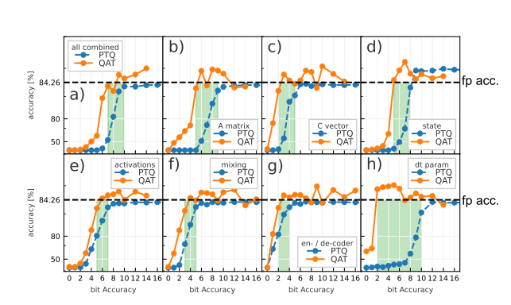
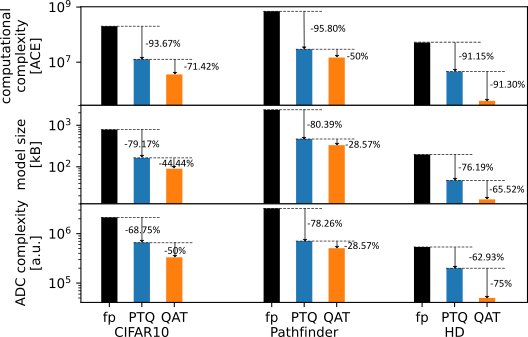
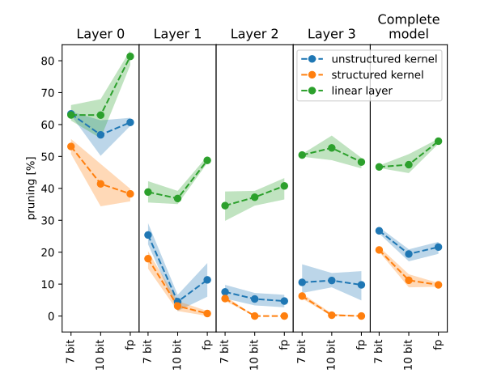
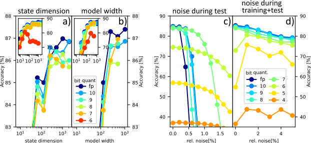

# Quantized structured State-Space sequential (S4 and S4D) model
This repository builds upon the work on S4 and S4D models implementing integer quantization of the models parameters and activations along with quantization-aware training.

## Quantization method and quantization-aware training

The quantization method is inspired by the integrer quantization method of BitNet (https://github.com/microsoft/BitNet). 
To perform quantization-aware training, a Straight-Through-Estimator is used, performing the forward-pass with the quantized value and using the identity as the surrogate for the quantization in the backward-pass. 
To perform a quantization-aware training run

`python training.py --dataset <DATASET> [DATASET OPTIONS] [MODEL PARAMETERS] [TARGET QUANTIZAION]`

DATASET OPTION:
 - grayscale: Only applicable for CIFAR10 task to run on grayscaled images (1 input channel) instead of RGB (3 input channels. This parameter is set for all CIFAR10 experiments in the manuscript.

DATASET OPTIONS:
 - n_layers_m: Number of consecutive S4(D) layers.
 - d_model_m: Number of parallel SSM kernels per layer (H parameter).
 - d_state: State dimensionper kernel (N parameter).

TARGET QUANTIZATION:
 - [A, C, linear, act, state, dt, coder]_quant: Sets the number of quantization states for a specific parameter like the A matrix, C vector, linear layers within the SSM kernel, activations, state, dt parameter, and en-/decoder layers. It specifies the number of states, so for 4 bit quantization, give 16 as value. Also values beyond 2^k are possible.
 - all_quant: Sets a homogeneous quantization for all parameters. If additionally, a speicific quantization value is specified this overwrites the homogeneous quantization value for this particular parameter.

## Results

### Parameter-wise quantization and quantization-aware training (QAT)
To check the impact of quantization and the benefits of QAT, the senquential CIFAR10 (grayscale) benchmark dataset can be use. Especially for the kernel parameters, A and C, the model performs close to the unquantized baseline for more aggressive quantization levels than performing unquantized training and quantizing after training only.

### Quantization reduces hardware cost

### Quantization helps with structured pruning

### Quantizability vs. model size and quantization reducing noise impact

